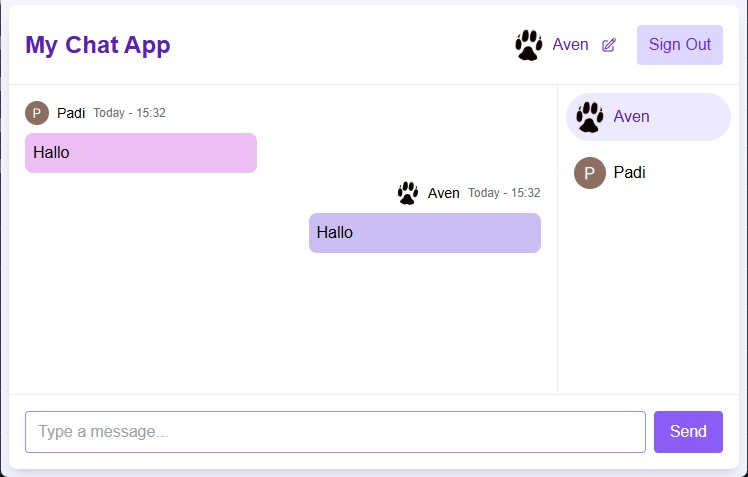

# A simple chat app with websocket



## Prerequisites

- Docker

## Run the entire app

Configure environment variables inside docker-compose.yaml (already set up for localhost).

```bash
docker compose up -d
```

Then access the frontend at http://localhost:3000 (or the configured host URL)
